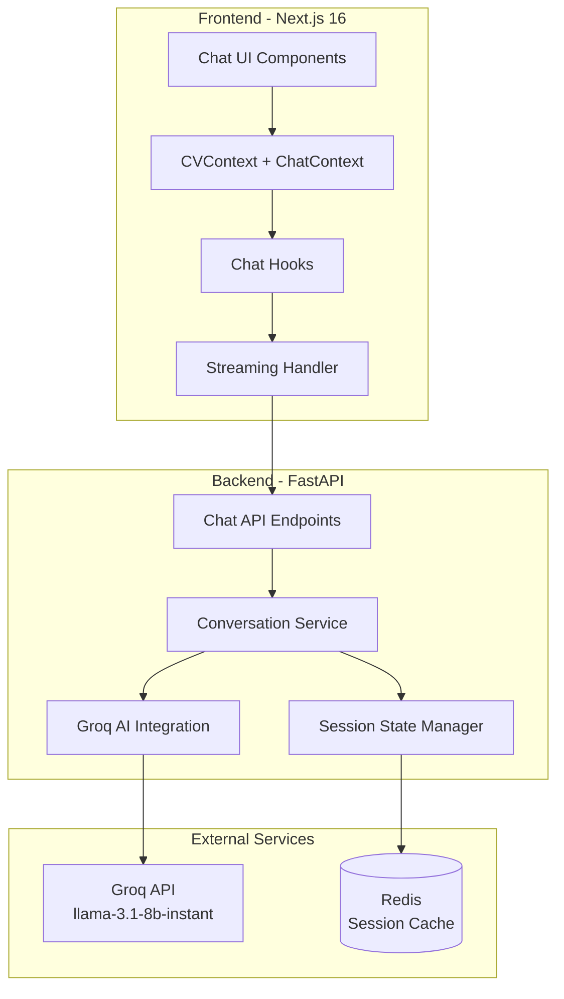
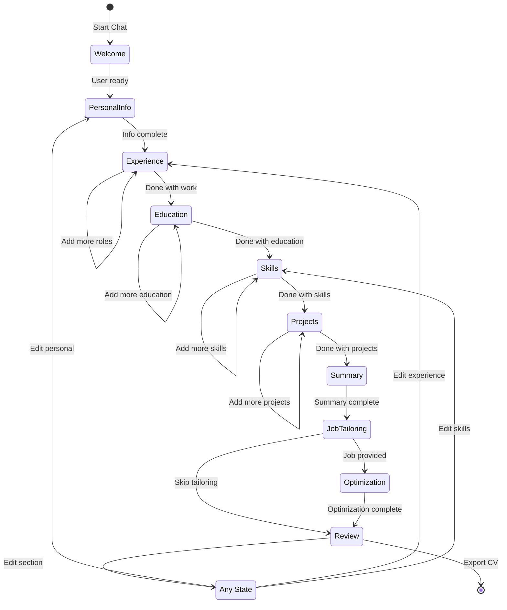
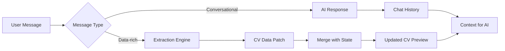
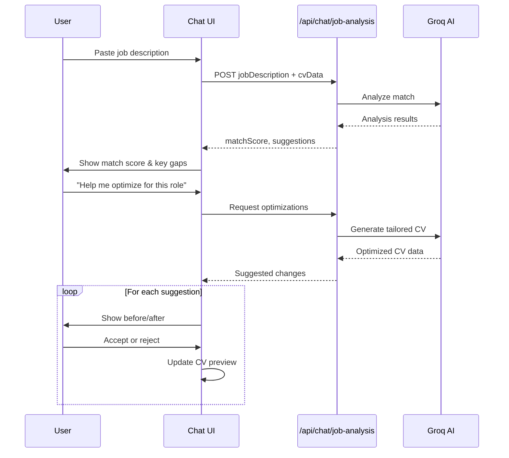

# Conversational CV Builder Architecture

## Overview

This document outlines the architecture for transforming CV-ConVos from a traditional 3-step wizard into an AI-powered conversational chat interface. The goal is to create a natural, coach-like experience where users build their CV through conversation rather than form-filling.

---

## 1. System Architecture

### 1.1 High-Level Architecture Diagram



### 1.2 Component Hierarchy

```
app/
├── chat/
│   ├── page.tsx                    # Main chat interface page
│   └── layout.tsx                  # Chat-specific layout
├── api/
│   └── chat/
│       └── route.ts                # Streaming API route handler
├── contexts/
│   ├── CVContext.tsx               # Existing CV state
│   └── ChatContext.tsx             # NEW: Chat conversation state
├── components/
│   ├── chat/
│   │   ├── ChatContainer.tsx       # Main chat wrapper
│   │   ├── ChatMessage.tsx         # Individual message bubble
│   │   ├── ChatInput.tsx           # Message input with actions
│   │   ├── ChatSuggestions.tsx     # Quick reply chips
│   │   ├── JobDescriptionModal.tsx # Job input dialog
│   │   ├── CVPreviewPanel.tsx      # Side-by-side CV preview
│   │   └── TypingIndicator.tsx     # AI typing animation
│   └── cv-builder/
│       └── ...                     # Existing components
├── hooks/
│   ├── use-chat.ts                 # NEW: Core chat logic
│   ├── use-chat-stream.ts          # NEW: Streaming handler
│   └── use-cv-history.ts           # Existing
├── lib/
│   ├── chat/
│   │   ├── conversation-flow.ts    # Question sequencing logic
│   │   ├── data-extractor.ts       # Parse AI responses to CV data
│   │   └── prompts.ts              # AI system prompts
│   └── ...
└── types/
    ├── chat.ts                     # NEW: Chat type definitions
    └── cv.ts                       # Existing
```

---

## 2. Conversation Flow Design

### 2.1 Conversation State Machine



### 2.2 Progressive Disclosure Strategy

The AI uses a **layered questioning approach** to avoid overwhelming users:

| Phase | Strategy | Example |
|-------|----------|---------|
| **Phase 1: Core** | Essential info only | "What's your name and current role?" |
| **Phase 2: Context** | High-level context | "Tell me about your most recent job" |
| **Phase 3: Detail** | Drill down as needed | "What were your key achievements there?" |
| **Phase 4: Polish** | Enhancements | "Shall I suggest skills based on your experience?" |

### 2.3 Multi-Turn Conversation Patterns

#### Experience Extraction Pattern

```
AI: Tell me about your work experience. Where are you currently working?

User: I'm a Senior Developer at TechCorp

AI: Great! How long have you been at TechCorp?

User: Since 2020

AI: And what does your role involve? Feel free to describe your main responsibilities.

User: I lead a team of 5 developers and work on our main product using React and Node.js

AI: Excellent leadership experience! What would you say is your biggest achievement there?

[AI extracts: company, position, startDate, description, and infers skills]
```

#### Clarification Pattern

```
User: I worked at a startup doing various things

AI: That sounds interesting! To help you showcase this best, could you tell me:
1. What was the startup's name?
2. What was your job title?
3. What kind of projects did you work on?
```

---

## 3. Data Extraction Strategy

### 3.1 Incremental Data Building

The system builds CV data incrementally through a **dual-track approach**:



### 3.2 Extraction Schema

Each AI response includes an optional **data extraction payload**:

```typescript
// types/chat.ts

interface DataExtraction {
  // Indicates what data was extracted from this message
  extracted: {
    personalInfo?: Partial<PersonalInfo>;
    experience?: Partial<Experience>[];
    education?: Partial<Education>[];
    skills?: Partial<Skill>[];
    projects?: Partial<Project>[];
    languages?: Partial<Language>[];
    certifications?: Partial<Certification>[];
  };
  // Confidence scores for each extraction (0-1)
  confidence: {
    [key: string]: number;
  };
  // Fields that need clarification
  needsClarification?: string[];
  // Next suggested questions
  followUpQuestions?: string[];
}

interface ChatMessage {
  id: string;
  role: 'user' | 'assistant' | 'system';
  content: string;
  timestamp: Date;
  extraction?: DataExtraction;
  metadata?: {
    phase: ConversationPhase;
    intent?: string;
    entities?: string[];
  };
}

type ConversationPhase = 
  | 'welcome'
  | 'personal_info'
  | 'experience'
  | 'education'
  | 'skills'
  | 'projects'
  | 'summary'
  | 'job_tailoring'
  | 'optimization'
  | 'review';
```

### 3.3 Extraction Confidence Levels

| Confidence | Action | Example |
|------------|--------|---------|
| **> 0.9** | Auto-apply | Clear name, email, dates |
| **0.7 - 0.9** | Apply with confirmation | "I understand you work at Google, is that right?" |
| **0.5 - 0.7** | Ask for confirmation | "Did you mention you have 5 years of experience?" |
| **< 0.5** | Ignore, continue conversation | Store as context only |

### 3.4 Handling Incomplete Information

```typescript
// lib/chat/data-extractor.ts

interface ExtractionResult {
  data: Partial<CVData>;
  completeness: {
    [section: string]: {
      required: string[];
      missing: string[];
      partial: string[];
    };
  };
  nextQuestions: string[];
}

function extractCVData(message: string, context: ChatContext): ExtractionResult {
  // Uses AI to extract structured data from natural language
  // Returns both extracted data and completeness analysis
}

function generateFollowUpQuestions(completeness: CompletenessMap): string[] {
  // Generates contextual questions to fill missing fields
  // Prioritizes required fields based on current phase
}
```

---

## 4. Backend API Design

### 4.1 New Endpoints

#### POST `/api/chat`
Main chat endpoint with streaming support.

**Request:**
```typescript
interface ChatRequest {
  message: string;
  sessionId: string;
  cvData: CVData;           // Current CV state
  history: ChatMessage[];   // Recent conversation history (last 10)
  phase: ConversationPhase;
  jobDescription?: string;  // If in tailoring phase
}
```

**Response (Streaming):**
```typescript
// Server-Sent Events format
interface ChatStreamEvent {
  type: 'delta' | 'extraction' | 'phase_change' | 'complete' | 'error';
  data: {
    // For 'delta' - text chunk
    content?: string;
    
    // For 'extraction' - extracted data
    extraction?: DataExtraction;
    
    // For 'phase_change' - new phase
    newPhase?: ConversationPhase;
    
    // For 'complete' - final message
    message?: ChatMessage;
    
    // For 'error'
    error?: string;
  };
}
```

#### POST `/api/chat/job-analysis`
Analyze job description and provide tailoring suggestions.

**Request:**
```typescript
interface JobAnalysisRequest {
  jobDescription: string;
  cvData: CVData;
}
```

**Response:**
```typescript
interface JobAnalysisResponse {
  matchScore: number;           // 0-100
  keyRequirements: string[];
  matchedSkills: string[];
  missingSkills: string[];
  suggestions: {
    section: string;
    current: string;
    suggested: string;
    reason: string;
  }[];
  optimizedCV?: CVData;
}
```

#### GET `/api/chat/session/{sessionId}`
Retrieve session state and history.

#### DELETE `/api/chat/session/{sessionId}`
Clear session (optional cleanup).

### 4.2 Pydantic Schemas (backend/app/api/chat_schemas.py)

```python
from pydantic import BaseModel, Field
from typing import List, Optional, Dict, Any, Literal
from datetime import datetime
from enum import Enum

class ConversationPhase(str, Enum):
    WELCOME = "welcome"
    PERSONAL_INFO = "personal_info"
    EXPERIENCE = "experience"
    EDUCATION = "education"
    SKILLS = "skills"
    PROJECTS = "projects"
    SUMMARY = "summary"
    JOB_TAILORING = "job_tailoring"
    OPTIMIZATION = "optimization"
    REVIEW = "review"

class ChatMessage(BaseModel):
    id: str = Field(..., description="Unique message ID")
    role: Literal["user", "assistant", "system"]
    content: str
    timestamp: datetime
    extraction: Optional[Dict[str, Any]] = None
    metadata: Optional[Dict[str, Any]] = None

class DataExtraction(BaseModel):
    extracted: Dict[str, Any] = Field(default_factory=dict)
    confidence: Dict[str, float] = Field(default_factory=dict)
    needs_clarification: List[str] = Field(default_factory=list)
    follow_up_questions: List[str] = Field(default_factory=list)

class ChatRequest(BaseModel):
    message: str = Field(..., min_length=1, max_length=5000)
    session_id: str
    cv_data: Dict[str, Any]  # CVData as dict
    history: List[ChatMessage] = Field(default_factory=list)
    phase: ConversationPhase
    job_description: Optional[str] = None

class ChatDeltaEvent(BaseModel):
    type: Literal["delta"] = "delta"
    content: str

class ChatExtractionEvent(BaseModel):
    type: Literal["extraction"] = "extraction"
    extraction: DataExtraction

class ChatPhaseChangeEvent(BaseModel):
    type: Literal["phase_change"] = "phase_change"
    new_phase: ConversationPhase
    reason: str

class ChatCompleteEvent(BaseModel):
    type: Literal["complete"] = "complete"
    message: ChatMessage
    final_extraction: Optional[DataExtraction] = None

class ChatErrorEvent(BaseModel):
    type: Literal["error"] = "error"
    error: str
    code: str

ChatStreamEvent = (
    ChatDeltaEvent | 
    ChatExtractionEvent | 
    ChatPhaseChangeEvent | 
    ChatCompleteEvent | 
    ChatErrorEvent
)

class JobAnalysisRequest(BaseModel):
    job_description: str = Field(..., min_length=50, max_length=10000)
    cv_data: Dict[str, Any]

class TailoringSuggestion(BaseModel):
    section: str
    current: str
    suggested: str
    reason: str
    priority: Literal["high", "medium", "low"]

class JobAnalysisResponse(BaseModel):
    match_score: int = Field(..., ge=0, le=100)
    key_requirements: List[str]
    matched_skills: List[str]
    missing_skills: List[str]
    suggestions: List[TailoringSuggestion]
    optimized_cv: Optional[Dict[str, Any]] = None
```

### 4.3 Session State Management

```python
# backend/app/services/conversation_service.py

from typing import Optional
import redis
import json
from datetime import datetime, timedelta

class ConversationSession:
    """Manages conversation state for a user session."""
    
    def __init__(self, session_id: str, redis_client: redis.Redis):
        self.session_id = session_id
        self.redis = redis_client
        self.ttl = timedelta(hours=24)
    
    async def get_state(self) -> Optional[Dict]:
        """Retrieve session state from Redis."""
        key = f"chat_session:{self.session_id}"
        data = self.redis.get(key)
        if data:
            return json.loads(data)
        return None
    
    async def save_state(self, state: Dict):
        """Save session state to Redis."""
        key = f"chat_session:{self.session_id}"
        self.redis.setex(
            key,
            self.ttl,
            json.dumps(state, default=str)
        )
    
    async def update_cv_data(self, cv_data: Dict):
        """Merge new CV data with existing state."""
        state = await self.get_state() or {}
        current_cv = state.get('cv_data', {})
        merged_cv = self._deep_merge(current_cv, cv_data)
        state['cv_data'] = merged_cv
        state['last_updated'] = datetime.utcnow().isoformat()
        await self.save_state(state)
        return merged_cv
    
    def _deep_merge(self, base: Dict, update: Dict) -> Dict:
        """Deep merge two dictionaries, with update taking precedence."""
        result = base.copy()
        for key, value in update.items():
            if key in result and isinstance(result[key], dict) and isinstance(value, dict):
                result[key] = self._deep_merge(result[key], value)
            elif key in result and isinstance(result[key], list) and isinstance(value, list):
                # For lists, we need smart merging based on IDs
                result[key] = self._merge_lists(result[key], value)
            else:
                result[key] = value
        return result
```

---

## 5. Frontend Architecture

### 5.1 ChatContext Design

```typescript
// contexts/ChatContext.tsx

interface ChatState {
  // Conversation
  messages: ChatMessage[];
  phase: ConversationPhase;
  isTyping: boolean;
  
  // CV Data (synced with CVContext)
  cvData: CVData;
  pendingExtractions: DataExtraction[];
  
  // Job Tailoring
  jobDescription: string | null;
  tailoringSuggestions: TailoringSuggestion[] | null;
  
  // UI State
  showPreview: boolean;
  activeSection: string | null;
}

interface ChatActions {
  sendMessage: (content: string) => Promise<void>;
  applyExtraction: (extraction: DataExtraction) => void;
  rejectExtraction: (extractionId: string) => void;
  setJobDescription: (description: string) => void;
  applyTailoring: (suggestion: TailoringSuggestion) => void;
  regenerateResponse: () => void;
  clearChat: () => void;
}

const ChatContext = createContext<{
  state: ChatState;
  actions: ChatActions;
} | null>(null);
```

### 5.2 Streaming Handler Hook

```typescript
// hooks/use-chat-stream.ts

import { useCallback, useRef, useState } from 'react';

interface UseChatStreamOptions {
  onDelta: (content: string) => void;
  onExtraction: (extraction: DataExtraction) => void;
  onPhaseChange: (phase: ConversationPhase) => void;
  onComplete: (message: ChatMessage) => void;
  onError: (error: Error) => void;
}

export function useChatStream(options: UseChatStreamOptions) {
  const [isStreaming, setIsStreaming] = useState(false);
  const abortControllerRef = useRef<AbortController | null>(null);

  const sendMessage = useCallback(async (request: ChatRequest) => {
    setIsStreaming(true);
    abortControllerRef.current = new AbortController();

    try {
      const response = await fetch('/api/chat', {
        method: 'POST',
        headers: { 'Content-Type': 'application/json' },
        body: JSON.stringify(request),
        signal: abortControllerRef.current.signal,
      });

      if (!response.ok) {
        throw new Error(`HTTP error! status: ${response.status}`);
      }

      const reader = response.body?.getReader();
      const decoder = new TextDecoder();

      if (!reader) {
        throw new Error('No response body');
      }

      let buffer = '';

      while (true) {
        const { done, value } = await reader.read();
        if (done) break;

        buffer += decoder.decode(value, { stream: true });
        const lines = buffer.split('\n');
        buffer = lines.pop() || '';

        for (const line of lines) {
          if (line.startsWith('data: ')) {
            const event: ChatStreamEvent = JSON.parse(line.slice(6));
            handleStreamEvent(event, options);
          }
        }
      }
    } catch (error) {
      if (error instanceof Error && error.name !== 'AbortError') {
        options.onError(error);
      }
    } finally {
      setIsStreaming(false);
    }
  }, [options]);

  const cancel = useCallback(() => {
    abortControllerRef.current?.abort();
    setIsStreaming(false);
  }, []);

  return { sendMessage, cancel, isStreaming };
}

function handleStreamEvent(event: ChatStreamEvent, options: UseChatStreamOptions) {
  switch (event.type) {
    case 'delta':
      options.onDelta(event.data.content || '');
      break;
    case 'extraction':
      options.onExtraction(event.data.extraction!);
      break;
    case 'phase_change':
      options.onPhaseChange(event.data.newPhase!);
      break;
    case 'complete':
      options.onComplete(event.data.message!);
      break;
    case 'error':
      options.onError(new Error(event.data.error!));
      break;
  }
}
```

### 5.3 Chat UI Component Structure

```typescript
// components/chat/ChatContainer.tsx

export function ChatContainer() {
  const { state, actions } = useChat();
  const { cvState, cvActions } = useCVData();
  const scrollRef = useRef<HTMLDivElement>(null);

  // Auto-scroll to bottom
  useEffect(() => {
    scrollRef.current?.scrollIntoView({ behavior: 'smooth' });
  }, [state.messages]);

  return (
    <div className="flex h-screen">
      {/* Chat Panel */}
      <div className="flex-1 flex flex-col max-w-3xl">
        {/* Messages */}
        <ScrollArea className="flex-1 p-4">
          {state.messages.map((msg) => (
            <ChatMessage key={msg.id} message={msg} />
          ))}
          {state.isTyping && <TypingIndicator />}
          <div ref={scrollRef} />
        </ScrollArea>

        {/* Suggestions */}
        {state.messages.length > 0 && !state.isTyping && (
          <ChatSuggestions 
            suggestions={getContextualSuggestions(state.phase)}
            onSelect={actions.sendMessage}
          />
        )}

        {/* Input */}
        <ChatInput 
          onSend={actions.sendMessage}
          disabled={state.isTyping}
          placeholder={getPlaceholderForPhase(state.phase)}
        />
      </div>

      {/* CV Preview Panel */}
      <CVPreviewPanel 
        cvData={cvState.present}
        highlightedSection={state.activeSection}
      />
    </div>
  );
}
```

---

## 6. Job-Specific Tailoring Feature

### 6.1 Feature Flow



### 6.2 Tailoring Analysis Prompt

```python
# backend/app/services/ai_service.py

JOB_ANALYSIS_PROMPT = """
Task: Analyze how well the candidate's CV matches the job description.

INPUT:
Job Description:
{job_description}

Current CV:
{cv_json}

OUTPUT FORMAT (JSON):
{{
  "match_score": 75,  // 0-100 overall match
  "key_requirements": ["req1", "req2", ...],  // Top 5 requirements from job
  "matched_skills": ["skill1", "skill2", ...],  // Skills candidate has that match
  "missing_skills": ["skill1", ...],  // Required skills not found
  "experience_gaps": ["gap1", ...],  // Missing experience areas
  "suggestions": [
    {{
      "section": "personalInfo.summary",
      "current": "...",
      "suggested": "...",
      "reason": "Aligns with job requirement for X",
      "priority": "high"  // high/medium/low
    }}
  ],
  "keyword_optimization": {{
    "add": ["keyword1", ...],
    "emphasize": ["keyword2", ...]
  }}
}}

RULES:
- Be honest about gaps but constructive
- Suggest specific rewording, not generic advice
- Prioritize high-impact changes
- Maintain factual accuracy - don't invent experience
"""
```

### 6.3 UI Integration

```typescript
// components/chat/JobTailoringPanel.tsx

interface JobTailoringPanelProps {
  analysis: JobAnalysisResponse | null;
  onApplySuggestion: (suggestion: TailoringSuggestion) => void;
  onApplyAll: () => void;
}

export function JobTailoringPanel({ 
  analysis, 
  onApplySuggestion,
  onApplyAll 
}: JobTailoringPanelProps) {
  if (!analysis) return null;

  return (
    <Card className="p-4 space-y-4">
      {/* Match Score */}
      <div className="flex items-center gap-4">
        <ScoreRing score={analysis.matchScore} />
        <div>
          <h3 className="font-semibold">Job Match Score</h3>
          <p className="text-sm text-muted-foreground">
            {analysis.matchScore >= 80 
              ? "Great match! Minor tweaks recommended."
              : analysis.matchScore >= 60
              ? "Good foundation. Some optimizations needed."
              : "Significant gaps. Let's work on improvements."}
          </p>
        </div>
      </div>

      {/* Missing Skills */}
      {analysis.missingSkills.length > 0 && (
        <Alert variant="warning">
          <AlertTitle>Missing Skills</AlertTitle>
          <AlertDescription>
            Consider adding: {analysis.missingSkills.join(', ')}
          </AlertDescription>
        </Alert>
      )}

      {/* Suggestions */}
      <div className="space-y-2">
        <h4 className="font-medium">Suggested Improvements</h4>
        {analysis.suggestions.map((suggestion, idx) => (
          <SuggestionCard
            key={idx}
            suggestion={suggestion}
            onApply={() => onApplySuggestion(suggestion)}
          />
        ))}
      </div>

      {/* Apply All */}
      <Button onClick={onApplyAll} className="w-full">
        Apply All Suggestions
      </Button>
    </Card>
  );
}
```

---

## 7. Technical Considerations

### 7.1 Streaming Implementation

**Why Streaming?**
- Provides immediate feedback (perceived performance)
- Natural conversation feel
- Allows incremental data extraction

**Implementation Details:**
```typescript
// app/api/chat/route.ts

export async function POST(request: Request) {
  const body: ChatRequest = await request.json();
  
  const stream = new ReadableStream({
    async start(controller) {
      const encoder = new TextEncoder();
      
      // Send to backend streaming endpoint
      const response = await fetch(`${API_URL}/chat`, {
        method: 'POST',
        headers: { 'Content-Type': 'application/json' },
        body: JSON.stringify(body),
      });

      const reader = response.body?.getReader();
      
      if (!reader) {
        controller.close();
        return;
      }

      // Forward backend stream to client
      while (true) {
        const { done, value } = await reader.read();
        if (done) break;
        controller.enqueue(value);
      }
      
      controller.close();
    },
  });

  return new Response(stream, {
    headers: {
      'Content-Type': 'text/event-stream',
      'Cache-Control': 'no-cache',
      'Connection': 'keep-alive',
    },
  });
}
```

### 7.2 Error Handling & Recovery

| Error Type | Strategy | User Experience |
|------------|----------|-----------------|
| **AI Timeout** | Retry with exponential backoff | "Let me think about that again..." |
| **Invalid Extraction** | Skip extraction, continue chat | Seamless - no user impact |
| **Rate Limit** | Queue request, show countdown | "High demand right now. Trying again in 5s..." |
| **Session Expired** | Create new session, restore CV data | "Welcome back! I've restored your CV." |
| **Network Error** | Auto-retry with offline indicator | Toast notification + retry button |

```typescript
// hooks/use-chat.ts

async function sendMessageWithRetry(
  message: string,
  retries = 3
): Promise<void> {
  for (let attempt = 0; attempt < retries; attempt++) {
    try {
      await sendMessage(message);
      return;
    } catch (error) {
      if (attempt === retries - 1) {
        // Final attempt failed
        toast.error('Failed to send message. Please try again.');
        throw error;
      }
      // Wait before retry
      await delay(Math.pow(2, attempt) * 1000);
    }
  }
}
```

### 7.3 Rate Limiting Strategy

**Current:** 10 requests/minute per IP

**Chat-Specific Considerations:**
- Each conversation turn = 1 request
- Streaming doesn't count as multiple requests
- Job analysis = 1 request (expensive operation)
- Implement client-side debouncing (500ms minimum between sends)

```typescript
// hooks/use-chat.ts

import { useDebounce } from '@/hooks/use-debounce';

export function useChat() {
  const [lastSendTime, setLastSendTime] = useState(0);
  const MIN_INTERVAL = 500; // ms

  const sendMessage = useCallback(async (content: string) => {
    const now = Date.now();
    const timeSinceLastSend = now - lastSendTime;
    
    if (timeSinceLastSend < MIN_INTERVAL) {
      await delay(MIN_INTERVAL - timeSinceLastSend);
    }
    
    setLastSendTime(Date.now());
    // ... send logic
  }, [lastSendTime]);
}
```

### 7.4 Performance Optimizations

1. **Message Truncation**: Send only last 10 messages to AI (with summary of earlier context)
2. **CV Data Sync**: Debounce CV updates to localStorage (1s)
3. **Preview Rendering**: Virtualize long CVs, only render visible sections
4. **Streaming Buffer**: Batch small chunks (50ms buffer)

---

## 8. Implementation Phases

### Phase 1: Foundation (Week 1)
- [ ] Create chat types and schemas
- [ ] Implement backend `/api/chat` endpoint with streaming
- [ ] Create ChatContext and basic state management
- [ ] Build ChatContainer and ChatMessage components
- [ ] Integrate with existing CVContext

**Deliverable:** Basic chat interface that can hold conversation

### Phase 2: Data Extraction (Week 2)
- [ ] Implement extraction prompts in AI service
- [ ] Create data-extractor.ts utility
- [ ] Add extraction confidence scoring
- [ ] Build extraction confirmation UI
- [ ] Connect extractions to CV state updates

**Deliverable:** Chat that extracts and builds CV data

### Phase 3: Conversation Flow (Week 3)
- [ ] Implement conversation state machine
- [ ] Create phase-specific system prompts
- [ ] Build progressive disclosure logic
- [ ] Add contextual suggestions
- [ ] Implement phase transitions

**Deliverable:** Guided conversation through all CV sections

### Phase 4: Job Tailoring (Week 4)
- [ ] Create job analysis endpoint
- [ ] Build JobDescriptionModal component
- [ ] Implement tailoring suggestions UI
- [ ] Add match score visualization
- [ ] Create apply/reject suggestion flow

**Deliverable:** Complete job tailoring feature

### Phase 5: Polish & Integration (Week 5)
- [ ] Add CV preview panel
- [ ] Implement error handling & recovery
- [ ] Add keyboard shortcuts
- [ ] Performance optimization
- [ ] Replace old wizard with new chat interface

**Deliverable:** Production-ready conversational wizard

---

## 9. AI Prompts

### 9.1 System Prompt

```python
CONVERSATIONAL_CV_SYSTEM_PROMPT = """
You are CV-ConVos, an expert career coach and CV writer. Your goal is to help users create outstanding CVs through natural conversation.

PERSONALITY:
- Professional yet friendly and encouraging
- Ask one question at a time to avoid overwhelming
- Celebrate progress and achievements
- Be concise but warm

CORE RULES:
1. NEVER invent information - only use what the user tells you
2. Ask clarifying questions when information is ambiguous
3. Guide users through CV sections in logical order
4. Suggest improvements but respect user choices
5. Always respond in the same language as the user

CONVERSATION PHASES:
1. WELCOME: Greet user, explain the process
2. PERSONAL_INFO: Name, contact, current role
3. EXPERIENCE: Work history (most recent first)
4. EDUCATION: Academic background
5. SKILLS: Technical and soft skills
6. PROJECTS: Notable projects (optional)
7. SUMMARY: Professional summary
8. JOB_TAILORING: Optimize for specific role
9. REVIEW: Final review and export

EXTRACTION FORMAT:
After each response, include extraction data in this JSON format:
```json
{
  "extracted": { ... },
  "confidence": { ... },
  "next_phase": "...",
  "follow_up": ["..."]
}
```

TONE EXAMPLES:
- Spanish: "¡Excelente! Me alegra saber que tienes experiencia en..."
- English: "Great! I'm glad to hear about your experience with..."
"""
```

### 9.2 Phase-Specific Prompts

See `backend/app/services/chat_prompts.py` for complete phase-specific prompts.

---

## 10. Testing Strategy

### 10.1 Unit Tests
- Chat state machine transitions
- Data extraction accuracy
- Stream event handling
- CV data merging logic

### 10.2 Integration Tests
- Full conversation flow
- Job analysis accuracy
- Streaming reliability
- Error recovery

### 10.3 E2E Tests
- Complete CV creation journey
- Job tailoring workflow
- Export functionality

---

## 11. Migration Plan

### From Wizard to Chat

1. **Parallel Deployment**: Keep wizard available at `/wizard` while chat is at `/chat`
2. **Feature Flag**: Use environment variable to control default route
3. **Data Migration**: Existing CV data automatically available in chat
4. **User Communication**: In-app announcement of new feature
5. **Deprecation**: Remove wizard after 2 weeks of chat stability

---

## Appendix A: Type Definitions

```typescript
// Complete type definitions for reference

// types/chat.ts
export * from './chat-types';

// types/chat-types.ts
export interface ChatSession {
  id: string;
  userId?: string;
  createdAt: Date;
  updatedAt: Date;
  cvData: CVData;
  messages: ChatMessage[];
  currentPhase: ConversationPhase;
  jobDescription?: string;
  metadata: {
    completedSections: string[];
    extractionCount: number;
    lastExtractionAt?: Date;
  };
}

export interface ConversationMetrics {
  totalMessages: number;
  averageResponseTime: number;
  extractionAccuracy: number;
  userSatisfaction?: number;
}
```

---

## Appendix B: API Endpoint Summary

| Endpoint | Method | Description |
|----------|--------|-------------|
| `/api/chat` | POST | Main chat endpoint (streaming) |
| `/api/chat/job-analysis` | POST | Analyze job description |
| `/api/chat/session/{id}` | GET | Get session state |
| `/api/chat/session/{id}` | DELETE | Clear session |

---

*Document Version: 1.0*
*Last Updated: 2026-01-29*
*Author: Architect Mode*
