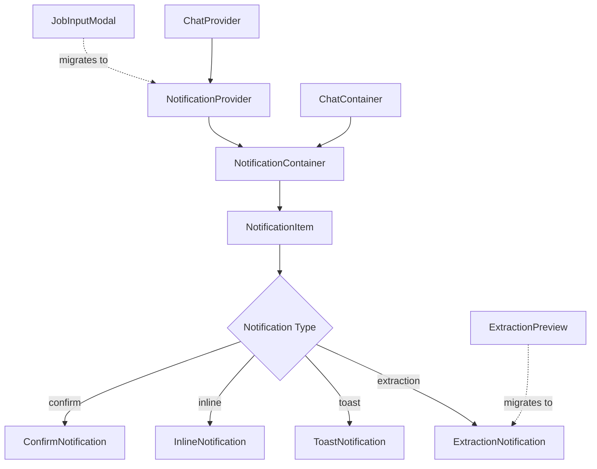

# Unified Notification System Architecture
## CV-ConVos Chat Interface

**Version:** 1.0  
**Date:** 2026-02-01  
**Status:** Design Specification

---

## 1. Executive Summary

### Problem Statement
The current notification system creates visual conflicts where the `ExtractionPreview` component renders as a full-screen modal overlay (`fixed inset-0 bg-background/80 backdrop-blur-sm`) while `ChatContainer` attempts to display it as a floating inline card. This results in:
- Complete UI obstruction during data extraction preview
- Poor user experience with forced context switching
- Inconsistent notification patterns across the chat interface

### Solution Overview
A unified notification system that consolidates all notification types (toasts, modals, inline) into a cohesive, non-intrusive layer that:
- Preserves conversation context
- Provides clear visual hierarchy
- Ensures full accessibility compliance
- Maintains responsive behavior across viewports

---

## 2. Component Hierarchy & Relationships

### 2.1 Architecture Overview



### 2.2 Component Definitions

#### NotificationProvider (New)
**Location:** `frontend/src/contexts/NotificationContext.tsx`

Central state management for all notifications. Wraps the chat interface and provides:
- Notification queue management
- Auto-dismiss timers
- Focus management coordination
- Keyboard event handling

**Props Interface:**
```typescript
interface NotificationProviderProps {
  children: React.ReactNode;
  maxNotifications?: number;        // Default: 3
  defaultDuration?: number;         // Default: 5000ms
  position?: NotificationPosition;  // Default: 'bottom-right'
}
```

#### NotificationContainer (New)
**Location:** `frontend/src/components/notifications/NotificationContainer.tsx`

Renders the notification stack within the chat container boundaries. Positioned absolutely within the chat panel to avoid full-screen overlays.

**Key Features:**
- Stacked notification layout (newest on top)
- Boundary containment within chat panel
- Z-index management (below modals, above content)
- Animation orchestration

#### NotificationItem (New)
**Location:** `frontend/src/components/notifications/NotificationItem.tsx`

Base wrapper component that handles:
- Common animation transitions
- Dismiss behavior
- ARIA attributes
- Focus trapping (for modal-like notifications)

#### Specialized Notification Components

**ExtractionNotification** (Replaces ExtractionPreview)
- Inline card format within chat flow
- Collapsible sections for data categories
- Individual field accept/reject actions
- Bulk apply/dismiss actions

**ToastNotification**
- Brief status messages
- Auto-dismiss with progress indicator
- Icon + text compact layout
- Action button support (optional)

**InlineNotification**
- Contextual messages within chat messages
- Error states for failed operations
- Warning states for validation issues
- Info states for guidance

**ConfirmNotification**
- Action confirmation dialogs
- Non-blocking inline format
- Clear yes/no or confirm/cancel actions

---

## 3. State Management Approach

### 3.1 Extend ChatContext vs New Context

**Decision:** Extend existing `ChatContext` with notification state

**Rationale:**
- Notifications are tightly coupled to chat operations
- Avoids prop drilling through component tree
- Simplifies migration from existing error/extraction state
- Maintains single source of truth for chat-related UI state

### 3.2 State Structure

```typescript
// Add to existing ChatState in types/chat.ts
interface ChatState {
  // ... existing fields
  notifications: NotificationItem[];
  activeNotificationId: string | null;
}

// New types for notification system
interface NotificationItem {
  id: string;
  type: NotificationType;
  variant: NotificationVariant;
  title?: string;
  message: string;
  duration?: number | null;  // null = persistent
  actions?: NotificationAction[];
  metadata?: NotificationMetadata;
  timestamp: Date;
  dismissible: boolean;
}

type NotificationType = 
  | 'extraction'    // Data extraction preview
  | 'toast'         // Brief status message
  | 'inline'        // Contextual message
  | 'confirm';      // Action confirmation

type NotificationVariant = 
  | 'info'          // Blue/gray - informational
  | 'success'       // Green - confirmation
  | 'warning'       // Yellow/amber - caution
  | 'error';        // Red - error state

interface NotificationAction {
  label: string;
  variant?: 'primary' | 'secondary' | 'destructive';
  onClick: () => void;
  icon?: React.ComponentType;
}

interface NotificationMetadata {
  // Type-specific metadata
  extraction?: DataExtraction;
  confirmCallback?: () => void;
  cancelCallback?: () => void;
}
```

### 3.3 Actions to Add to ChatContext

```typescript
interface ChatActions {
  // ... existing actions
  
  // Notification actions
  showNotification: (notification: Omit<NotificationItem, 'id' | 'timestamp'>) => string;
  dismissNotification: (id: string) => void;
  dismissAllNotifications: () => void;
  updateNotification: (id: string, updates: Partial<NotificationItem>) => void;
}
```

### 3.4 Reducer Updates

```typescript
type ChatAction =
  // ... existing actions
  | { type: 'SHOW_NOTIFICATION'; payload: NotificationItem }
  | { type: 'DISMISS_NOTIFICATION'; payload: string }
  | { type: 'DISMISS_ALL_NOTIFICATIONS' }
  | { type: 'UPDATE_NOTIFICATION'; payload: { id: string; updates: Partial<NotificationItem> } }
  | { type: 'SET_ACTIVE_NOTIFICATION'; payload: string | null };
```

---

## 4. Notification Positioning Strategy

### 4.1 Positioning Philosophy

**Core Principle:** Notifications must appear within or adjacent to the chat container, never obscuring the entire interface.

### 4.2 Position Variants

#### Extraction Notifications
- **Desktop:** Inline card within chat message flow, above input area
- **Mobile:** Full-width card, collapsible, fixed above input
- **Behavior:** Persists until user action (apply/dismiss)

#### Toast Notifications
- **Desktop:** Bottom-right of chat panel, stacked vertically
- **Mobile:** Bottom of screen, full-width with padding
- **Behavior:** Auto-dismiss with visual countdown

#### Inline Notifications
- **Position:** Within chat message bubble or adjacent to relevant content
- **Behavior:** Contextual, dismissible, may persist until resolved

#### Confirm Notifications
- **Position:** Inline within chat flow, replacing or adjacent to triggering message
- **Behavior:** Persists until user responds

### 4.3 Visual Layout Specifications

```
┌─────────────────────────────────────┐
│  Chat Header                        │
├─────────────────────────────────────┤
│                                     │
│  Message History                    │
│  ┌─────────────────────────────┐   │
│  │ User: I worked at Google    │   │
│  └─────────────────────────────┘   │
│                                     │
│  ┌─────────────────────────────┐   │
│  │ Assistant: Great! I found   │   │
│  │ these details:              │   │
│  └─────────────────────────────┘   │
│                                     │
│  ┌─────────────────────────────┐   │
│  │ EXTRACTION NOTIFICATION     │   │  ← Inline card
│  │ ┌─────────────────────────┐ │   │
│  │ │ Company: Google         │ │   │
│  │ │ Position: [accept/reject]│ │   │
│  │ └─────────────────────────┘ │   │
│  │ [Apply All]  [Dismiss]      │   │
│  └─────────────────────────────┘   │
│                                     │
│  ┌─────────────────────────────┐   │
│  │ TOAST: Changes saved ✓      │   │  ← Stacked toast
│  └─────────────────────────────┘   │
│                                     │
├─────────────────────────────────────┤
│  Input Area                         │
└─────────────────────────────────────┘
```

### 4.4 Z-Index Layering

```
Layer 1 (z-0):   Chat content, messages
Layer 2 (z-10):  Inline notifications
Layer 3 (z-20):  Extraction cards
Layer 4 (z-30):  Toast notifications
Layer 5 (z-40):  Modal dialogs (if needed)
Layer 6 (z-50):  Focus trap overlays
```

---

## 5. Type Definitions

### 5.1 Core Types

```typescript
// frontend/src/types/notifications.ts

/**
 * Notification system types for CV-ConVos chat interface
 */

// =============================================================================
// ENUMS & CONSTANTS
// =============================================================================

export type NotificationType = 'extraction' | 'toast' | 'inline' | 'confirm';

export type NotificationVariant = 'info' | 'success' | 'warning' | 'error';

export type NotificationPosition = 
  | 'top-left' 
  | 'top-center' 
  | 'top-right'
  | 'bottom-left' 
  | 'bottom-center' 
  | 'bottom-right';

// =============================================================================
// CORE INTERFACES
// =============================================================================

/**
 * Individual notification item
 */
export interface NotificationItem {
  id: string;
  type: NotificationType;
  variant: NotificationVariant;
  title?: string;
  message: string;
  duration: number | null;  // null = persistent until dismissed
  actions: NotificationAction[];
  metadata: NotificationMetadata;
  timestamp: Date;
  dismissible: boolean;
  priority: 'low' | 'normal' | 'high';
}

/**
 * Action button configuration
 */
export interface NotificationAction {
  id: string;
  label: string;
  variant: 'primary' | 'secondary' | 'destructive' | 'ghost';
  onClick: () => void;
  icon?: React.ComponentType<{ className?: string }>;
  disabled?: boolean;
  loading?: boolean;
}

/**
 * Type-specific metadata
 */
export interface NotificationMetadata {
  // Extraction notification data
  extraction?: {
    data: DataExtraction;
    onApply: (extraction: DataExtraction) => void;
    onDismiss: () => void;
    fieldActions?: Record<string, {
      onAccept: () => void;
      onReject: () => void;
    }>;
  };
  
  // Confirmation dialog data
  confirm?: {
    onConfirm: () => void;
    onCancel: () => void;
    confirmLabel?: string;
    cancelLabel?: string;
    destructive?: boolean;
  };
  
  // Toast-specific
  toast?: {
    showProgress?: boolean;
    pauseOnHover?: boolean;
  };
  
  // Inline-specific
  inline?: {
    relatedMessageId?: string;
    fieldPath?: string;
  };
}

// =============================================================================
// CONFIGURATION
// =============================================================================

/**
 * Notification system configuration
 */
export interface NotificationConfig {
  maxNotifications: number;
  defaultDuration: number;
  position: NotificationPosition;
  animations: AnimationConfig;
  accessibility: AccessibilityConfig;
}

export interface AnimationConfig {
  enterDuration: number;
  exitDuration: number;
  staggerDelay: number;
  easing: string;
}

export interface AccessibilityConfig {
  announceToScreenReader: boolean;
  trapFocus: boolean;
  restoreFocus: boolean;
  closeOnEscape: boolean;
  closeOnClickOutside: boolean;
}

// =============================================================================
// UTILITY TYPES
// =============================================================================

/**
 * Helper type for creating notifications
 */
export type CreateNotificationInput = Omit<NotificationItem, 'id' | 'timestamp'>;

/**
 * Notification filter/sort options
 */
export interface NotificationFilter {
  types?: NotificationType[];
  variants?: NotificationVariant[];
  dismissibleOnly?: boolean;
  persistentOnly?: boolean;
}
```

### 5.2 Integration with Existing Types

```typescript
// Add to frontend/src/types/chat.ts

// Extend ChatState
export interface ChatState {
  messages: ChatMessage[];
  currentPhase: ConversationPhase;
  isStreaming: boolean;
  sessionId: string;
  extractedData: DataExtraction | null;
  error: string | null;
  jobDescription: string | null;
  // NEW: Notification system integration
  notifications: NotificationItem[];
  activeNotificationId: string | null;
}

// Extend ChatActions
export interface ChatActions {
  sendMessage: (content: string) => Promise<void>;
  startNewConversation: () => void;
  applyExtraction: (extraction: DataExtraction) => void;
  resetChat: () => void;
  setJobDescription: (description: string) => void;
  // NEW: Notification actions
  showNotification: (notification: CreateNotificationInput) => string;
  dismissNotification: (id: string) => void;
  dismissAllNotifications: () => void;
  updateNotification: (id: string, updates: Partial<NotificationItem>) => void;
  setActiveNotification: (id: string | null) => void;
}
```

---

## 6. Animation & Transition Specifications

### 6.1 Animation Philosophy

- **Purposeful:** Animations guide attention and provide feedback
- **Performant:** Use CSS transforms and opacity only
- **Accessible:** Respect `prefers-reduced-motion`
- **Consistent:** Unified timing and easing across all notification types

### 6.2 Animation Specifications

#### Enter Animation (All Types)
```css
/* From bottom (default) */
@keyframes notification-enter {
  from {
    opacity: 0;
    transform: translateY(16px) scale(0.96);
  }
  to {
    opacity: 1;
    transform: translateY(0) scale(1);
  }
}

/* Duration: 200ms */
/* Easing: cubic-bezier(0.16, 1, 0.3, 1) (ease-out-expo) */
```

#### Exit Animation (All Types)
```css
@keyframes notification-exit {
  from {
    opacity: 1;
    transform: translateY(0) scale(1);
  }
  to {
    opacity: 0;
    transform: translateY(-8px) scale(0.96);
  }
}

/* Duration: 150ms */
/* Easing: cubic-bezier(0.4, 0, 1, 1) (ease-in) */
```

#### Stagger Animation (Stacked Notifications)
```typescript
// Each subsequent notification delays by 50ms
const staggerDelay = 50; // ms
const maxStagger = 200;  // Cap at 200ms total delay
```

#### Toast Progress Animation
```css
@keyframes toast-progress {
  from { width: 100%; }
  to { width: 0%; }
}

/* Duration: matches toast duration (default 5000ms) */
/* Easing: linear */
```

#### Extraction Card Expand/Collapse
```css
@keyframes extraction-expand {
  from {
    opacity: 0;
    max-height: 0;
    transform: translateY(-8px);
  }
  to {
    opacity: 1;
    max-height: 500px;
    transform: translateY(0);
  }
}

/* Duration: 300ms */
/* Easing: cubic-bezier(0.16, 1, 0.3, 1) */
```

### 6.3 Framer Motion Implementation

```typescript
// Animation variants for Framer Motion
export const notificationAnimations = {
  container: {
    hidden: { opacity: 0 },
    visible: {
      opacity: 1,
      transition: {
        staggerChildren: 0.05,
        delayChildren: 0.1,
      },
    },
    exit: {
      opacity: 0,
      transition: {
        staggerChildren: 0.03,
        staggerDirection: -1,
      },
    },
  },
  
  item: {
    hidden: {
      opacity: 0,
      y: 16,
      scale: 0.96,
    },
    visible: {
      opacity: 1,
      y: 0,
      scale: 1,
      transition: {
        duration: 0.2,
        ease: [0.16, 1, 0.3, 1],
      },
    },
    exit: {
      opacity: 0,
      y: -8,
      scale: 0.96,
      transition: {
        duration: 0.15,
        ease: [0.4, 0, 1, 1],
      },
    },
  },
  
  extractionCard: {
    collapsed: {
      height: 'auto',
      opacity: 1,
    },
    expanded: {
      height: 'auto',
      opacity: 1,
      transition: {
        duration: 0.3,
        ease: [0.16, 1, 0.3, 1],
      },
    },
  },
};
```

### 6.4 Reduced Motion Support

```typescript
// Hook to respect user preferences
export function useReducedMotion(): boolean {
  const [reducedMotion, setReducedMotion] = useState(false);
  
  useEffect(() => {
    const mediaQuery = window.matchMedia('(prefers-reduced-motion: reduce)');
    setReducedMotion(mediaQuery.matches);
    
    const handler = (event: MediaQueryListEvent) => {
      setReducedMotion(event.matches);
    };
    
    mediaQuery.addEventListener('change', handler);
    return () => mediaQuery.removeEventListener('change', handler);
  }, []);
  
  return reducedMotion;
}

// Usage in animations
const reducedMotion = useReducedMotion();
const animationProps = reducedMotion 
  ? {} 
  : { initial: 'hidden', animate: 'visible', exit: 'exit' };
```

---

## 7. Accessibility Requirements

### 7.1 ARIA Implementation

#### Notification Container
```tsx
<div
  role="region"
  aria-label="Notifications"
  aria-live="polite"
  aria-atomic="false"
  className="notification-container"
>
  {/* Notifications */}
</div>
```

#### Individual Notification
```tsx
<div
  role="alert"
  aria-labelledby={`notification-${id}-title`}
  aria-describedby={`notification-${id}-description`}
  className="notification-item"
>
  <h3 id={`notification-${id}-title`}>{title}</h3>
  <p id={`notification-${id}-description`}>{message}</p>
</div>
```

#### Extraction Notification (Complex)
```tsx
<div
  role="dialog"
  aria-modal="false"  // Not a true modal, inline instead
  aria-labelledby="extraction-title"
  aria-describedby="extraction-description"
>
  <h2 id="extraction-title">Datos Detectados</h2>
  <p id="extraction-description">Revisa los datos extraídos de tu mensaje</p>
  
  <fieldset>
    <legend>Campos detectados</legend>
    {/* Field previews with individual controls */}
  </fieldset>
</div>
```

### 7.2 Keyboard Navigation

#### Global Shortcuts
| Key | Action | Scope |
|-----|--------|-------|
| `Escape` | Dismiss active/last notification | Global when notification visible |
| `Tab` | Navigate through notification actions | Within notification |
| `Shift+Tab` | Navigate backwards | Within notification |
| `Enter` / `Space` | Activate focused action | Within notification |

#### Focus Management

```typescript
// Focus trap for extraction notifications
export function useNotificationFocus(notificationId: string, isActive: boolean) {
  const containerRef = useRef<HTMLDivElement>(null);
  const previousFocusRef = useRef<HTMLElement | null>(null);
  
  useEffect(() => {
    if (isActive) {
      // Store previous focus
      previousFocusRef.current = document.activeElement as HTMLElement;
      
      // Focus first focusable element
      const container = containerRef.current;
      if (container) {
        const focusable = container.querySelector<HTMLElement>(
          'button, [href], input, select, textarea, [tabindex]:not([tabindex="-1"])'
        );
        focusable?.focus();
      }
    } else {
      // Restore focus on dismiss
      previousFocusRef.current?.focus();
    }
  }, [isActive]);
  
  return containerRef;
}
```

### 7.3 Screen Reader Support

#### Live Region Configuration
```tsx
// For time-sensitive notifications
<div 
  role="status" 
  aria-live="polite"
  aria-atomic="true"
>
  Changes saved successfully
</div>

// For critical errors
<div 
  role="alert" 
  aria-live="assertive"
  aria-atomic="true"
>
  Error: Failed to save changes
</div>
```

#### Announcement Utility
```typescript
export function announceToScreenReader(message: string, priority: 'polite' | 'assertive' = 'polite') {
  const announcement = document.createElement('div');
  announcement.setAttribute('role', 'status');
  announcement.setAttribute('aria-live', priority);
  announcement.setAttribute('aria-atomic', 'true');
  announcement.className = 'sr-only';
  announcement.textContent = message;
  
  document.body.appendChild(announcement);
  
  setTimeout(() => {
    document.body.removeChild(announcement);
  }, 1000);
}
```

### 7.4 Visual Accessibility

#### Color Contrast Requirements
- **Error (red):** Minimum 4.5:1 contrast ratio
- **Success (green):** Minimum 4.5:1 contrast ratio
- **Warning (yellow/amber):** Minimum 4.5:1 contrast ratio
- **Info (blue/gray):** Minimum 4.5:1 contrast ratio

#### Focus Indicators
```css
.notification-item:focus-within {
  outline: 2px solid hsl(var(--primary));
  outline-offset: 2px;
}

.notification-action:focus-visible {
  outline: 2px solid hsl(var(--primary));
  outline-offset: 2px;
  border-radius: 4px;
}
```

### 7.5 Accessibility Checklist

- [ ] All notifications have appropriate ARIA roles
- [ ] Color is not the sole means of conveying information
- [ ] Focus is managed and restored appropriately
- [ ] Keyboard navigation is fully supported
- [ ] Screen reader announcements are clear and concise
- [ ] Reduced motion preferences are respected
- [ ] High contrast mode is supported
- [ ] Touch targets are minimum 44x44px

---

## 8. Responsive Behavior Specifications

### 8.1 Breakpoint Strategy

| Breakpoint | Width | Notification Behavior |
|------------|-------|----------------------|
| Mobile | < 640px | Full-width, stacked vertically, bottom-aligned |
| Tablet | 640px - 1024px | Max-width 480px, right-aligned |
| Desktop | > 1024px | Max-width 400px, right-aligned within chat panel |

### 8.2 Mobile Specifications

#### Layout
```css
/* Mobile notification container */
.notification-container {
  position: fixed;
  bottom: 80px; /* Above input area */
  left: 16px;
  right: 16px;
  max-height: 50vh;
  overflow-y: auto;
  z-index: 30;
}

/* Mobile notification item */
.notification-item {
  width: 100%;
  margin-bottom: 8px;
}
```

#### Touch Interactions
- Swipe left/right to dismiss (toast notifications)
- Tap to expand/collapse (extraction notifications)
- Long press for additional options
- Pull down to refresh/dismiss all

#### Safe Area Support
```css
.notification-container {
  padding-bottom: env(safe-area-inset-bottom, 0);
  padding-left: env(safe-area-inset-left, 16px);
  padding-right: env(safe-area-inset-right, 16px);
}
```

### 8.3 Desktop Specifications

#### Layout
```css
/* Desktop notification container within chat panel */
.notification-container {
  position: absolute;
  bottom: 100%; /* Above input area */
  right: 0;
  width: 100%;
  max-width: 400px;
  padding: 16px;
  pointer-events: none; /* Allow clicks through empty space */
}

.notification-item {
  pointer-events: auto;
  margin-bottom: 8px;
}
```

### 8.4 Responsive Component Behavior

#### ExtractionNotification
| Feature | Mobile | Desktop |
|---------|--------|---------|
| Layout | Full-width card, collapsible | Inline within chat flow |
| Field display | Accordion sections | Expandable sections |
| Actions | Bottom sticky bar | Inline with content |
| Max height | 60vh | Auto (scrolls with chat) |

#### ToastNotification
| Feature | Mobile | Desktop |
|---------|--------|---------|
| Width | 100% - 32px | 320px |
| Position | Bottom center | Bottom right of chat panel |
| Stacking | Vertical | Vertical with 8px gap |
| Dismiss | Swipe or tap X | Click X or auto-dismiss |

#### InlineNotification
| Feature | Mobile | Desktop |
|---------|--------|---------|
| Width | 100% of message | 100% of message |
| Icon size | 20px | 16px |
| Text size | 14px | 14px |
| Padding | 12px | 12px |

---

## 9. Migration Plan

### 9.1 Migration Phases

#### Phase 1: Foundation (Week 1)
**Goal:** Establish notification system infrastructure

**Tasks:**
1. Create `NotificationContext` and provider
2. Update `ChatState` and `ChatActions` types
3. Create base `NotificationContainer` component
4. Create `NotificationItem` wrapper component
5. Add reducer actions for notifications

**Files to Create:**
- `frontend/src/contexts/NotificationContext.tsx` (new)
- `frontend/src/types/notifications.ts` (new)
- `frontend/src/components/notifications/NotificationContainer.tsx` (new)
- `frontend/src/components/notifications/NotificationItem.tsx` (new)
- `frontend/src/components/notifications/index.ts` (new)

**Files to Modify:**
- `frontend/src/types/chat.ts` (extend interfaces)
- `frontend/src/contexts/ChatContext.tsx` (add notification state/actions)

#### Phase 2: Component Migration (Week 2)
**Goal:** Migrate existing notification patterns

**Tasks:**
1. Create `ExtractionNotification` component (replaces ExtractionPreview)
2. Create `ToastNotification` component
3. Create `InlineNotification` component
4. Update `ChatContainer` to use new notification system
5. Deprecate old `ExtractionPreview` modal behavior

**Files to Create:**
- `frontend/src/components/notifications/ExtractionNotification.tsx` (new)
- `frontend/src/components/notifications/ToastNotification.tsx` (new)
- `frontend/src/components/notifications/InlineNotification.tsx` (new)

**Files to Modify:**
- `frontend/src/components/cv-builder/chat/ChatContainer.tsx` (integrate notifications)
- `frontend/src/components/cv-builder/chat/ExtractionPreview.tsx` (mark deprecated)

#### Phase 3: Integration & Refactoring (Week 3)
**Goal:** Integrate with existing features and remove old patterns

**Tasks:**
1. Migrate `JobInputModal` error states to inline notifications
2. Update error handling in `ChatContext` to use notifications
3. Add notification triggers for key user actions
4. Remove deprecated `ExtractionPreview` modal code
5. Update tests for new notification system

**Files to Modify:**
- `frontend/src/components/cv-builder/chat/JobInputModal.tsx` (migrate errors)
- `frontend/src/contexts/ChatContext.tsx` (update error handling)
- `frontend/src/components/cv-builder/chat/ExtractionPreview.tsx` (remove modal)

#### Phase 4: Polish & Testing (Week 4)
**Goal:** Ensure quality and accessibility compliance

**Tasks:**
1. Implement comprehensive unit tests
2. Add accessibility tests (axe-core)
3. Test responsive behavior across devices
4. Performance optimization
5. Documentation updates

**Files to Create:**
- `frontend/src/components/notifications/__tests__/NotificationContainer.test.tsx`
- `frontend/src/components/notifications/__tests__/ExtractionNotification.test.tsx`
- `frontend/src/components/notifications/__tests__/ToastNotification.test.tsx`

### 9.2 Backward Compatibility

#### Deprecation Strategy
```typescript
// In ExtractionPreview.tsx - mark as deprecated
/**
 * @deprecated Use ExtractionNotification instead. 
 * This component will be removed in v2.0.
 * @see ExtractionNotification
 */
export function ExtractionPreview({ ... }) {
  // Existing implementation with console warning
  useEffect(() => {
    console.warn(
      'ExtractionPreview is deprecated. Use ExtractionNotification instead.'
    );
  }, []);
  // ...
}
```

#### Migration Helpers
```typescript
// Helper to convert old extraction props to notification
export function createExtractionNotification(
  extraction: DataExtraction,
  onApply: (data: DataExtraction) => void,
  onDismiss: () => void
): CreateNotificationInput {
  return {
    type: 'extraction',
    variant: 'info',
    title: 'Datos Detectados',
    message: 'Revisa los datos extraídos de tu mensaje',
    duration: null,
    dismissible: true,
    priority: 'high',
    metadata: {
      extraction: {
        data: extraction,
        onApply,
        onDismiss,
      },
    },
  };
}
```

### 9.3 Code Examples

#### Before (Current Implementation)
```tsx
// ChatContainer.tsx - Current
<AnimatePresence>
  {state.extractedData && showExtractionPreview && (
    <motion.div className="absolute left-4 right-4 bottom-[140px] z-50">
      <ExtractionPreview
        extraction={state.extractedData}
        onApply={handleApplyExtraction}
        onDismiss={() => setShowExtractionPreview(false)}
      />
    </motion.div>
  )}
</AnimatePresence>
```

#### After (New Implementation)
```tsx
// ChatContainer.tsx - New
import { useNotification } from '@/contexts/NotificationContext';

function ChatContainer() {
  const { showNotification, dismissNotification } = useNotification();
  const { state } = useChat();
  
  // Show extraction notification when data arrives
  useEffect(() => {
    if (state.extractedData) {
      const notificationId = showNotification({
        type: 'extraction',
        variant: 'info',
        title: 'Datos Detectados',
        message: 'Revisa los datos extraídos de tu mensaje',
        duration: null,
        dismissible: true,
        priority: 'high',
        metadata: {
          extraction: {
            data: state.extractedData,
            onApply: (data) => {
              actions.applyExtraction(data);
              dismissNotification(notificationId);
            },
            onDismiss: () => dismissNotification(notificationId),
          },
        },
      });
    }
  }, [state.extractedData]);
  
  // Notification container renders inline
  return (
    <div className="chat-container">
      <NotificationContainer position="inline" />
      {/* ... rest of chat UI */}
    </div>
  );
}
```

### 9.4 Testing Strategy

#### Unit Tests
```typescript
// NotificationContext.test.tsx
describe('NotificationContext', () => {
  it('should show a notification', () => {
    const { result } = renderHook(() => useNotification(), { wrapper });
    
    act(() => {
      result.current.showNotification({
        type: 'toast',
        variant: 'success',
        message: 'Test message',
      });
    });
    
    expect(result.current.notifications).toHaveLength(1);
  });
  
  it('should auto-dismiss toast after duration', async () => {
    jest.useFakeTimers();
    const { result } = renderHook(() => useNotification(), { wrapper });
    
    act(() => {
      result.current.showNotification({
        type: 'toast',
        variant: 'info',
        message: 'Auto dismiss',
        duration: 5000,
      });
    });
    
    expect(result.current.notifications).toHaveLength(1);
    
    act(() => {
      jest.advanceTimersByTime(5000);
    });
    
    expect(result.current.notifications).toHaveLength(0);
  });
});
```

#### Accessibility Tests
```typescript
// ExtractionNotification.a11y.test.tsx
describe('ExtractionNotification Accessibility', () => {
  it('should have correct ARIA attributes', () => {
    render(<ExtractionNotification {...defaultProps} />);
    
    expect(screen.getByRole('dialog')).toHaveAttribute('aria-labelledby');
    expect(screen.getByRole('dialog')).toHaveAttribute('aria-describedby');
  });
  
  it('should trap focus when active', async () => {
    render(<ExtractionNotification {...defaultProps} isActive />);
    
    const firstButton = screen.getAllByRole('button')[0];
    expect(firstButton).toHaveFocus();
  });
  
  it('should dismiss on Escape key', async () => {
    const onDismiss = jest.fn();
    render(<ExtractionNotification {...defaultProps} onDismiss={onDismiss} />);
    
    await userEvent.keyboard('{Escape}');
    expect(onDismiss).toHaveBeenCalled();
  });
});
```

---

## 10. Implementation Checklist

### Pre-Implementation
- [ ] Review existing notification patterns in codebase
- [ ] Audit current accessibility implementation
- [ ] Identify all notification trigger points
- [ ] Define notification content/copy

### Implementation
- [ ] Create notification types and interfaces
- [ ] Implement NotificationContext
- [ ] Build NotificationContainer component
- [ ] Create specialized notification components
- [ ] Integrate with ChatContext
- [ ] Implement animations
- [ ] Add keyboard navigation
- [ ] Implement focus management
- [ ] Add screen reader support

### Testing
- [ ] Unit tests for all components
- [ ] Integration tests with ChatContext
- [ ] Accessibility audit (axe-core)
- [ ] Keyboard navigation testing
- [ ] Screen reader testing (NVDA/VoiceOver)
- [ ] Responsive testing (mobile/tablet/desktop)
- [ ] Cross-browser testing

### Documentation
- [ ] Update component documentation
- [ ] Add usage examples
- [ ] Document migration path
- [ ] Update CHANGELOG

### Deployment
- [ ] Feature flag for gradual rollout
- [ ] Monitor error rates
- [ ] Gather user feedback
- [ ] Remove deprecated code (Phase 4)

---

## 11. Appendix

### A. Design Tokens

```css
/* Notification-specific CSS variables */
:root {
  /* Colors */
  --notification-info-bg: hsl(var(--info) / 0.1);
  --notification-info-border: hsl(var(--info) / 0.2);
  --notification-info-text: hsl(var(--info));
  
  --notification-success-bg: hsl(var(--success) / 0.1);
  --notification-success-border: hsl(var(--success) / 0.2);
  --notification-success-text: hsl(var(--success));
  
  --notification-warning-bg: hsl(var(--warning) / 0.1);
  --notification-warning-border: hsl(var(--warning) / 0.2);
  --notification-warning-text: hsl(var(--warning));
  
  --notification-error-bg: hsl(var(--destructive) / 0.1);
  --notification-error-border: hsl(var(--destructive) / 0.2);
  --notification-error-text: hsl(var(--destructive));
  
  /* Spacing */
  --notification-padding: 12px 16px;
  --notification-gap: 8px;
  --notification-border-radius: var(--radius);
  
  /* Shadows */
  --notification-shadow: 0 4px 12px rgba(0, 0, 0, 0.15);
  
  /* Animation */
  --notification-enter-duration: 200ms;
  --notification-exit-duration: 150ms;
  --notification-stagger-delay: 50ms;
}
```

### B. Icon Mapping

| Variant | Icon | Lucide Import |
|---------|------|---------------|
| info | Info circle | `Info` |
| success | Check circle | `CheckCircle2` |
| warning | Alert triangle | `AlertTriangle` |
| error | X octagon | `OctagonX` |
| extraction | Sparkles | `Sparkles` |
| confirm | Help circle | `HelpCircle` |

### C. File Structure

```
frontend/src/
├── contexts/
│   └── NotificationContext.tsx      # NEW
├── types/
│   └── notifications.ts             # NEW
├── components/
│   └── notifications/
│       ├── index.ts                 # NEW
│       ├── NotificationContainer.tsx # NEW
│       ├── NotificationItem.tsx     # NEW
│       ├── ExtractionNotification.tsx # NEW
│       ├── ToastNotification.tsx    # NEW
│       ├── InlineNotification.tsx   # NEW
│       ├── ConfirmNotification.tsx  # NEW
│       └── __tests__/
│           ├── NotificationContainer.test.tsx
│           ├── ExtractionNotification.test.tsx
│           └── ToastNotification.test.tsx
└── hooks/
    └── use-notification.ts          # NEW (convenience hook)
```

---

## 12. References

- [WAI-ARIA Authoring Practices - Alert](https://www.w3.org/WAI/ARIA/apg/patterns/alert/)
- [WAI-ARIA Authoring Practices - Dialog](https://www.w3.org/WAI/ARIA/apg/patterns/dialog-modal/)
- [WCAG 2.1 - Non-text Contrast](https://www.w3.org/WAI/WCAG21/Understanding/non-text-contrast.html)
- [Shadcn UI - Sonner](https://ui.shadcn.com/docs/components/sonner)
- [Framer Motion - AnimatePresence](https://www.framer.com/motion/animate-presence/)

---

**End of Document**
